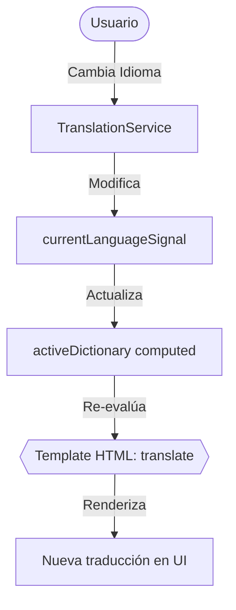

# Documentación de Arquitectura - Sprint 1 (Estructuración, PWA y Multi-idioma)

Este documento detalla la estructura inicial del proyecto **Rural-Tech**, el funcionamiento de su Service Worker y el sistema de internacionalización reactivo para Español y Quechua.

---

## 1. Estructura de Carpetas del Proyecto

El código del frontend de la aplicación sigue una arquitectura modular y desacoplada basada en componentes Standalone. A continuación se detalla la estructura física del directorio `src/app/`:

```
src/
├── app/
│   ├── components/       # Componentes visuales de la aplicación
│   │   ├── auth/         # Login y Registro (Sprint 2)
│   │   ├── courses/      # Detalle de cursos y visor de clases (Sprint 4-5)
│   │   ├── dashboard/    # Panel principal del estudiante (Sprint 4)
│   │   ├── layout/       # Componentes globales (Navbar, Footer) (Sprint 4)
│   │   └── sync/         # Gestor de almacenamiento y caché (Sprint 5)
│   ├── i18n/             # Diccionarios de traducción local
│   │   ├── spanish.ts    # Traducciones en Español
│   │   └── quechua.ts     # Traducciones en Quechua
│   ├── services/         # Capa lógica y de datos (Servicios)
│   │   ├── auth.service.ts         # Autenticación JWT mockeada (Sprint 2)
│   │   ├── course.service.ts       # Descargas y gestión de cursos (Sprint 4)
│   │   ├── indexeddb.service.ts    # Base de datos local IndexedDB (Sprint 3)
│   │   ├── sync.service.ts         # Sincronización automática de red (Sprint 3)
│   │   └── translation.service.ts  # Servicio de traducción reactiva (Sprint 1)
│   ├── app.config.ts     # Proveedores e inicialización global
│   ├── app.routes.ts     # Rutas de la aplicación (Lazy Loaded)
│   ├── app.ts            # Componente raíz (Standalone)
│   ├── app.html          # Plantilla principal (App Shell)
│   └── app.css           # Estilos específicos de la app raíz
├── docs/                 # Documentación técnica por Sprints
│   └── sprint1_arquitectura.md
└── public/               # Recursos estáticos globales (PWA)
    ├── manifest.webmanifest   # Manifiesto de la aplicación progresiva
    └── icons/                 # Iconos PWA para dispositivos móviles
```

---

## 2. Configuración de PWA y Service Worker

El paquete `@angular/pwa` ha integrado el Service Worker a través de `@angular/service-worker` y configurado el archivo `ngsw-config.json` en la raíz del proyecto.

### Estrategias de Caché Definidas (`ngsw-config.json`):
1. **Asset Groups (Recursos Estáticos):**
   - **`app` (Caché Inmediato / Prefetch):** Almacena de inmediato `index.html`, los scripts compilados (`main.js`, `polyfills.js`, `styles.css`) y el manifiesto. Esto garantiza que la estructura básica (App Shell) cargue instantáneamente incluso sin conexión.
   - **`assets` (Caché bajo demanda / Lazy):** Almacena iconos, imágenes y fuentes del directorio `public/` o `assets/` conforme el usuario los requiera, evitando saturar la memoria inicial del dispositivo móvil.

2. **Data Groups (Peticiones de API - Sprint 3):**
   - Se configurará para interceptar llamadas al backend de cursos y progreso con la estrategia `freshness` (network-first) y un fallback automático al caché local si no hay conexión a Internet.

---

## 3. Funcionamiento de las Traducciones Reactivas

Para dar soporte a **Español** y **Quechua**, se ha implementado una solución ligera basada en **Angular Signals** y diccionarios estáticos, evitando el overhead de librerías externas pesadas.



### Mecánica del Servicio:
- **`currentLanguageSignal` (Signal):** Guarda el código del idioma seleccionado (`es` | `qu`). Se inicializa leyendo la preferencia guardada en `localStorage` o tomando `'es'` por defecto.
- **`activeDictionary` (Computed Signal):** Se re-evalúa automáticamente cuando el idioma cambia, seleccionando el objeto `SpanishTranslations` o `QuechuaTranslations`.
- **Método `translate(key)`:** Busca la clave en el diccionario activo. Al ser llamado desde los componentes o directamente en las directivas del HTML, la vista se subscribe automáticamente al Signal, permitiendo un cambio de idioma instantáneo sin necesidad de recargar la página.
