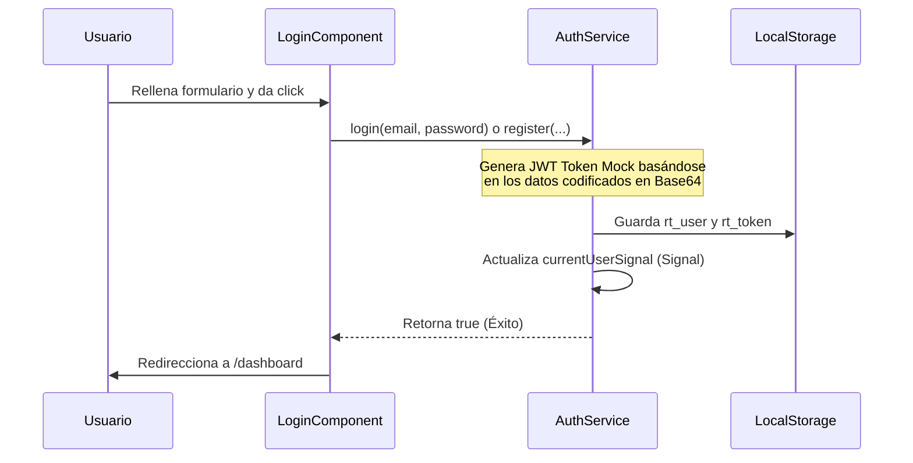

# Guía de Estilos y Autenticación - Sprint 2 (Diseño y Autenticación)

Este documento describe la identidad visual neo-brutalista implementada en la aplicación **Rural-Tech**, la estructura del formulario de registro/acceso y la lógica del servicio de autenticación JWT.

---

## 1. Guía de Estilos Visuales (Neo-brutalismo)

Basado en las maquetas visuales, el archivo [styles.css](file:///c:/Users/Victus/Documents/Rural-Tech/Rural-Tech/src/styles.css) implementa una hoja de estilo neo-brutalista limpia con bordes definidos, contrastes altos y sombras sin difuminado.

### Variables CSS Utilizadas:
```css
:root {
  /* Paleta de Colores de la Referencia */
  --bg-cream: #ece8e1;          /* Fondo cálido general */
  --accent-yellow: #ebd047;     /* Acento principal / Botones */
  --accent-blue: #4f46e5;       /* Tarjeta offline (Índigo) */
  --accent-red: #c2410c;        /* Tarjeta comunidad (Terracota) */
  --card-gray: #d4d0c9;         /* Tarjeta de información general */
  --neutral-white: #ffffff;     /* Fondos de formulario */
  --neutral-black: #000000;     /* Bordes y texto */
  --neutral-dark: #111111;      /* Fondo de botón primario */
  
  /* Bordes y Sombras Offset */
  --border-thick: 2px solid #000000;
  --border-thicker: 3px solid #000000;
  --shadow-neo: 4px 4px 0px #000000;
  --shadow-neo-hover: 6px 6px 0px #000000;
  --shadow-neo-active: 1px 1px 0px #000000;
}
```

### Características de la Maquetación:
1. **Esquinas Afiladas:** Se utiliza `border-radius: 0` en todas las tarjetas, campos de formulario y pestañas, respetando el corte geométrico rígido del neo-brutalismo.
2. **Sombras Planas (Offset):** Las sombras de botones y tarjetas no tienen difuminado (`box-shadow: 4px 4px 0px #000000`). En el estado activo (`:active`), el botón se desplaza `translate(3px, 3px)` y reduce su sombra a `1px` simulando una pulsación física.
3. **Tipografía Outfit:** Importada desde Google Fonts, elegida por su geometría circular que contrasta perfectamente con las esquinas rectas de los componentes.

---

## 2. Lógica de Autenticación JWT Mock

Para simular una conexión real con el backend de FastAPI sin necesidad de dependencias externas en este paso, la lógica de [auth.service.ts](file:///c:/Users/Victus/Documents/Rural-Tech/Rural-Tech/src/app/services/auth.service.ts) realiza lo siguiente:



### Token Generado:
El token se compone de tres partes simuladas separadas por puntos (formato estándar de JWT):
- **Parte 1 (Header):** `mock-jwt-header`
- **Parte 2 (Payload):** Los datos del perfil del usuario (nombre, correo electrónico, rol, comunidad) serializados a JSON y codificados en Base64.
- **Parte 3 (Signature):** `mock-signature`

Esto permite que en el futuro, al conectar con FastAPI, solo se requiera cambiar el endpoint HTTP, ya que el almacenamiento y formato del token local es idéntico al estándar JWT real.

---

## 3. Roles de Usuario y Flujo de Pantallas

La aplicación soporta dos perfiles mediante el selector bilingüe del formulario:
1. **Estudiante / Productor (`student`):** Enfocado en la descarga y lectura offline de módulos de formación técnica y cuestionarios.
2. **Docente / Técnico (`teacher`):** Enfocado en el seguimiento de avance del aula y carga de materiales.

### Bypass Offline
El botón **MODO OFFLINE ACTIVADO** permite un acceso rápido directo a la aplicación como usuario invitado sin requerir cuenta, útil para estudiantes en zonas rurales sin señal celular inicial.
