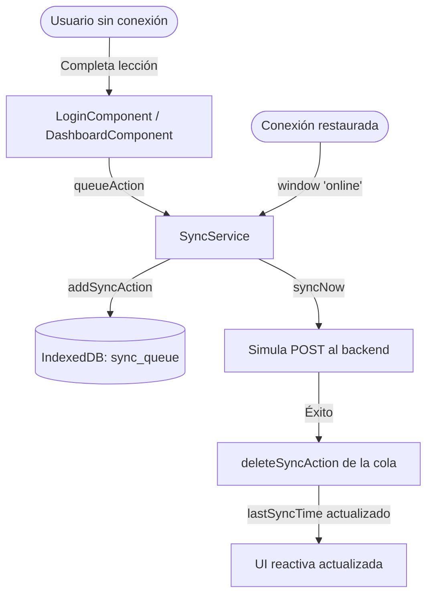

# Documentación Sprint 3 - Capa Offline, Servicios y Vistas Principales

Este documento describe la implementación del **Sprint 3** de **Rural-Tech**, que comprende la capa de datos offline con IndexedDB, el servicio de sincronización reactiva, y las tres vistas principales basadas en las mockups entregadas.

---

## 1. Servicios Implementados

### `IndexedDbService` ([src/app/services/indexeddb.service.ts](file:///c:/Users/Victus/Documents/Rural-Tech/Rural-Tech/src/app/services/indexeddb.service.ts))

Inicializa una base de datos IndexedDB llamada `rural_tech_db` con los siguientes almacenes (object stores):

| Store          | Descripción                                              | Clave         |
|----------------|----------------------------------------------------------|---------------|
| `courses`      | Metadatos de cursos descargados                          | `id`          |
| `progress`     | Progreso del usuario por lección                         | `id`          |
| `downloads`    | Lista de archivos guardados en el dispositivo            | `name`        |
| `sync_queue`   | Acciones pendientes de sincronización con el servidor    | Autoincrement |
| `settings`     | Preferencias de la app                                   | Manual key    |

### `SyncService` ([src/app/services/sync.service.ts](file:///c:/Users/Victus/Documents/Rural-Tech/Rural-Tech/src/app/services/sync.service.ts))

- Detecta cambios de conectividad con `window.addEventListener('online' | 'offline')`.
- Expone `isOnline` y `isSyncing` como **Angular Signals** para actualización reactiva de la UI.
- Al recuperar conexión, ejecuta automáticamente `syncNow()` vaciando la cola de acciones pendientes.
- `clearCache()` elimina cursos y archivos locales, liberando espacio en el dispositivo.

### `CourseService` ([src/app/services/course.service.ts](file:///c:/Users/Victus/Documents/Rural-Tech/Rural-Tech/src/app/services/course.service.ts))

- Provee un listado mock de cursos activos con progreso y estado de descarga.
- `downloadsInProgress` simula descargas activas con barra de progreso animada cada 1 segundo.
- Al completar una descarga, marca el curso como `downloaded: true` y persiste el archivo en IndexedDB.

---

## 2. Componentes de Interfaz Implementados

### Landing Page — `HomeComponent` ([src/app/components/home/](file:///c:/Users/Victus/Documents/Rural-Tech/Rural-Tech/src/app/components/home/))
Basado en **Mockup 1**:
- **Hero Section:** Fondo amarillo izquierdo con título "EDUCACIÓN SIN LÍMITES." en rojo, ilustración SVG de árbol nocturno con estudiante, y badge flotante "+500 RECURSOS OFFLINE" en índigo.
- **Áreas de Estudio:** Grid 2x2 neo-brutalista con tarjetas temáticas (gris, roja, azul, amarilla).
- **Modo Offline:** Sección explicativa con 3 pasos (CONECTA → SINCRONIZA → APRENDE) con íconos SVG en cajas de colores.
- **Footer:** Dark con logo, copyright y links de soporte.

### Dashboard — `DashboardComponent` ([src/app/components/dashboard/](file:///c:/Users/Victus/Documents/Rural-Tech/Rural-Tech/src/app/components/dashboard/))
Basado en **Mockup 2**:
- **Header PROGRESO:** Título gigante con subtítulo motivacional.
- **Tarjeta Curso Destacado:** Card amarilla con badge "ÚLTIMA LECCIÓN", barra de progreso sólida, y botón "CONTINUAR VIENDO".
- **Grilla de Cursos Activos:** 2 columnas con miniaturas con overlay de color por tema, barras de progreso mini, y botón de flecha.
- **Sidebar Derecho:** Estado offline/online reactivo, tarjetas de estadísticas (12h / 03 certificados), y biblioteca de archivos descargados.

### Sync Status — `SyncStatusComponent` ([src/app/components/sync/](file:///c:/Users/Victus/Documents/Rural-Tech/Rural-Tech/src/app/components/sync/))
Basado en **Mockup 3**:
- **Header:** Título "SYNC STATUS" con badge de red (OFFLINE MODE ACTIVE / ONLINE MODE ACTIVE) y botón "SYNCHRONIZE NOW".
- **Storage + Ilustración:** Gauge de almacenamiento usado (1.2GB/5.0GB) + ilustración SVG de placa de circuito con trazas iluminadas en azul índigo.
- **Downloads in Progress:** Filas con badges de urgencia, barra de progreso animada en amarillo, porcentaje y tamaño.
- **Ready for Offline Grid:** Tarjetas blancas sobre fondo amarillo con archivos listos y marca de verificación.
- **Need More Space:** Tarjeta índigo con botón "MANAGE STORAGE" para limpiar caché.

---

## 3. Estructura Final de Carpetas (Sprint 1 a 3)

```
src/app/
├── components/
│   ├── auth/
│   │   ├── login.ts          ✅ Sprint 2
│   │   ├── login.html        ✅ Sprint 2
│   │   └── login.css         ✅ Sprint 2
│   ├── home/
│   │   ├── home.ts           ✅ Sprint 3
│   │   ├── home.html         ✅ Sprint 3
│   │   └── home.css          ✅ Sprint 3
│   ├── dashboard/
│   │   ├── dashboard.ts      ✅ Sprint 3
│   │   ├── dashboard.html    ✅ Sprint 3
│   │   └── dashboard.css     ✅ Sprint 3
│   ├── layout/
│   │   └── navbar.ts         ✅ Sprint 3
│   └── sync/
│       ├── sync-status.ts    ✅ Sprint 3
│       ├── sync-status.html  ✅ Sprint 3
│       └── sync-status.css   ✅ Sprint 3
├── services/
│   ├── auth.service.ts       ✅ Sprint 2
│   ├── course.service.ts     ✅ Sprint 3
│   ├── indexeddb.service.ts  ✅ Sprint 3
│   ├── sync.service.ts       ✅ Sprint 3
│   └── translation.service.ts ✅ Sprint 1
└── i18n/
    ├── spanish.ts             ✅ Sprint 1
    └── quechua.ts             ✅ Sprint 1
```

---

## 4. Flujo de Datos Offline


